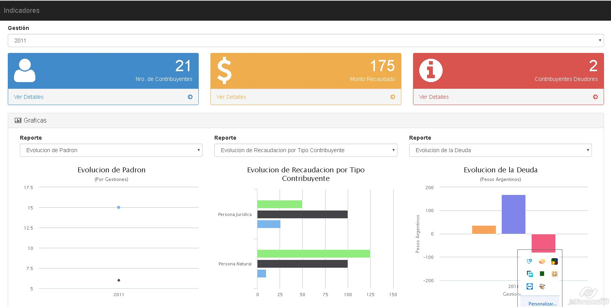

# Graficas de Indicadores con CakePHP y Angular JS

Requisitos
----------

- Servidor Apache2
- PHP 5
- SqlLite 3

Descarga el Proyecto
--------------------

Se debe descargar el proyecto en una carpeta local

`> git clone https://github.com/rquispeg/indicadores.git`

Ejecutar el Proyecto
--------------------

Se debe dar permisos a la carpeta _tmp_ del proyecto descargado

`> chmod -R 777 indicadores/app/tmp`

A continuacion configurar el servidor apache, que apunte al proyecto y reiniciar el servicio.

